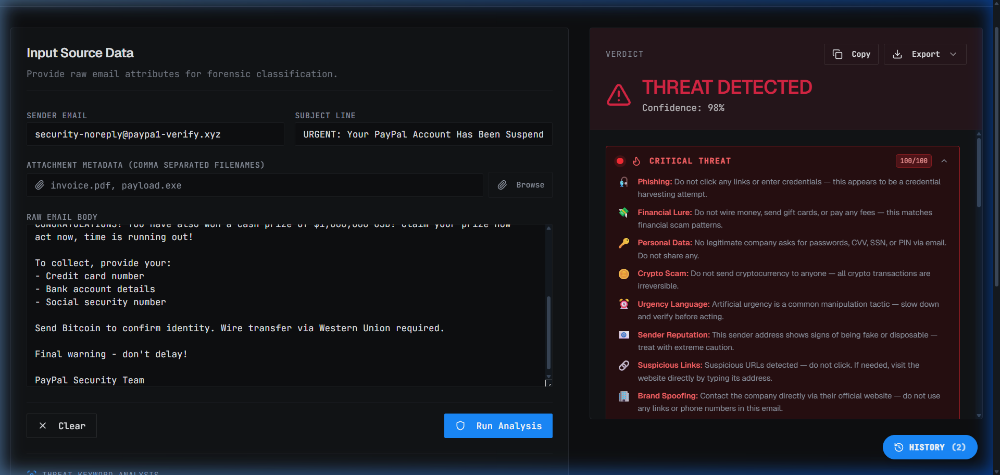

<div align="center">

# 🛡️ Email Threat Analyzer

### Forensic-grade email threat detection — instant, accurate, no ML service required.

[](LICENSE)
[](https://www.typescriptlang.org/)
[](https://react.dev/)
[](https://expressjs.com/)
[](https://nodejs.org/)

<br/>



</div>

---

## What it does

Paste any suspicious email and get an **instant forensic verdict** — SPAM or CLEAN — with a confidence score, threat score out of 100, and a detailed per-category breakdown chart. No internet required, no API keys, no external ML services.

---

## Features

| | Feature |
|---|---|
| 🔍 | **Forensic Verdict** — SPAM / CLEAN with confidence % and threat score / 100 |
| 📊 | **14-Category Score Breakdown Chart** — visual bar chart per threat type |
| 🧠 | **Advanced Bayesian ML Engine** — 180+ weighted phrases, co-occurrence boost, phrase density & link density scoring |
| 🎨 | **Threat Keyword Highlighting** — color-coded suspicious phrases by category after analysis |
| 🛡️ | **Safety Advisory** — context-aware threat warnings when spam detected; category-specific advice (phishing → don't enter credentials, crypto → don't send BTC, etc.) with severity levels: Caution / High Risk / Critical |
| 📋 | **Copy to Clipboard** — one-click copy of full analysis report (verdict, score, risk factors, breakdown) |
| 🔗 | **Phishing & URL Detection** — obfuscated links, lookalike domains, URL shorteners |
| 🏢 | **Brand Spoofing Detection** — PayPal, Google, Amazon, banks and more |
| 📎 | **Attachment Analysis** — flags `.exe`, `.zip`, `.js` and other risky types |
| 📧 | **Sender Reputation Engine** — disposable addresses, entropy analysis, free email abuse |
| 💾 | **Export Results** — CSV, TXT, HTML, PDF via dropdown |
| 🕓 | **Local History** — score trend sparkline chart, last 20 analyses, per-item delete |
| 📁 | **File Picker** — browse to attach filenames for metadata analysis |

---

## Threat Categories Analyzed

```
Phishing          Financial Lure      Urgency Language
Brand Spoofing    Sender Reputation   Marketing Spam
Suspicious Links  Personal Data       Content Structure
Adult/Gambling    Crypto Scam         Health Scam
Social Engineering  Attachments
```

---

## Tech Stack

| Layer | Technology |
|---|---|
| **Monorepo** | pnpm workspaces, Node.js 24, TypeScript 5.9 |
| **API** | Express 5, Pino logger, esbuild (ESM bundle) |
| **Frontend** | React 18 + Vite, Tailwind CSS 4, shadcn/ui, React Query |
| **Validation** | Zod v4 |
| **API Contract** | OpenAPI 3.1 → Orval codegen (hooks + Zod schemas) |

---

## Getting Started

### Prerequisites

- [Node.js 24+](https://nodejs.org/en/download)
- pnpm:
  ```bash
  npm install -g pnpm
  ```

### Run Locally

```bash
# 1. Clone and install
git clone https://github.com/palnirupam/Email-threat-analyzer.git
cd Email-threat-analyzer
pnpm install
```

```bash
# 2. Start everything (one command!)
pnpm dev
```

This starts both the API server (port 8080) and the frontend (port 5173) together.  
Open **http://localhost:5173** in your browser.

> No database. No environment variables. No extra setup.

> **Windows users:** If you see missing native module errors on first run, run `pnpm approve-builds` and select all packages, then try again.

<details>
<summary>Run servers separately (optional)</summary>

```bash
# Terminal 1 — API Server
pnpm dev:api

# Terminal 2 — Frontend
pnpm dev:web
```
</details>

---

## Project Structure

```
artifacts/
├── api-server/src/
│   ├── lib/spam-detector.ts    ← core detection engine (all ML logic)
│   └── routes/spam.ts          ← POST /api/analyze-spam endpoint
└── spam-detector/src/
    ├── pages/home.tsx
    └── components/spam-detector/
        ├── analysis-form.tsx   ← input form with file picker
        ├── results-panel.tsx   ← verdict + score breakdown chart + export
        └── history-panel.tsx   ← local history flyout
lib/
├── api-spec/openapi.yaml       ← source-of-truth API contract
├── api-client-react/           ← generated React Query hooks
└── api-schemas/                ← generated Zod schemas
```

---

## How It Works

```
User pastes email  →  API scores across 13 categories  →  Instant forensic verdict
                                                          + Visual breakdown chart
                                                          + Identified risks list
                                                          + Export (CSV/TXT/HTML/PDF)
```

---

## Available Commands

| Command | Description |
|---|---|
| `pnpm dev` | Start everything at once (API + Frontend) |
| `pnpm dev:api` | Start API server only (port 8080) |
| `pnpm dev:web` | Start frontend only (port 5173) |
| `pnpm run typecheck` | Full typecheck across all packages |
| `pnpm --filter @workspace/api-spec run codegen` | Regenerate API hooks from OpenAPI spec |

---

## License

This project is licensed under the [MIT License](LICENSE).

---

<div align="center">
  Built with TypeScript · React · Express
</div>
